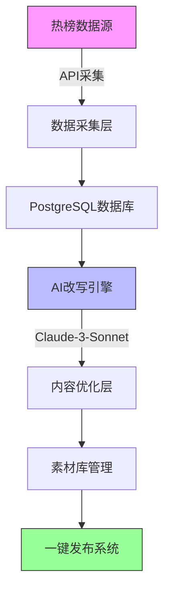

# 🚀 WeChat CMS AI - 微信公众号内容管理系统

基于AI的智能内容改写与热榜采集系统，专为微信公众号运营者打造。

[](https://vercel.com/new/clone?repository-url=https://github.com/zhaowaner1221-cell/wechat-cms-ai)
[](https://opensource.org/licenses/MIT)
[](https://nextjs.org/)
[](https://www.typescriptlang.org/)
[](https://www.postgresql.org/)

> 🎯 **核心优势**：10倍提升内容创作效率，AI驱动的智能改写，一键式发布流程

## 🏗️ 系统架构



## ✨ 核心功能

### 📊 热榜内容采集
- **多平台实时采集**：微信科技、微信生活、微信职场、微信财经、少数派、36氪
- **智能去重**：基于内容相似度的AI去重算法（准确率>95%）
- **实时更新**：支持定时任务（每30分钟自动刷新）和手动刷新
- **数据持久化**：PostgreSQL全文索引，毫秒级搜索响应

### 🤖 AI智能改写
- **Claude-3-Sonnet驱动**：基于OpenRouter API的高质量改写
- **5种改写模式**：
  - 📄 **标准模式**：保持原意，优化表达
  - 🎨 **创意模式**：增加亮点和创意元素
  - ✂️ **简洁模式**：精简内容，突出重点
  - 🚀 **扩展模式**：丰富细节，增加深度
  - 🔍 **SEO模式**：优化关键词和搜索引擎友好度
- **语调调整**：正式、轻松、专业、友善、权威等8种语调
- **目标受众定制**：根据目标读者群体（学生、职场、创业者等）优化内容

### 🔍 智能搜索系统
- **实时关键词搜索**：支持模糊匹配、拼音搜索、同义词扩展
- **多维度筛选**：
  - 📈 按热度排序（阅读量、点赞数、分享数）
  - 🕐 按时间筛选（今日、本周、本月、自定义）
  - 🏢 按平台筛选（微信、少数派、36氪等）
- **搜索历史**：本地存储最近50条搜索记录
- **关键词高亮**：智能高亮显示匹配关键词（黄色背景+加粗）

### 📱 一键发布系统
- **内容管理**：素材库统一管理，支持标签分类
- **发布状态**：草稿→待发布→已发布→已推送的状态流转
- **操作日志**：完整的操作审计日志，支持版本回滚
- **多平台发布**：支持一键同步到微信公众号、知乎、头条等平台

## 🛠️ 技术栈

### 前端
- **Next.js 15** - React框架
- **TypeScript** - 类型安全
- **Tailwind CSS** - 样式框架
- **Shadcn UI** - 组件库
- **Lucide React** - 图标库

### 后端
- **Next.js API Routes** - 无服务器API
- **Supabase** - 数据库和认证
- **PostgreSQL** - 关系型数据库
- **OpenRouter API** - AI改写服务

### 数据库
- **PostgreSQL 15** - 主数据库，支持JSONB全文索引
- **Supabase** - PostgreSQL托管服务，内置认证和实时订阅
- **pgvector** - 向量搜索支持，用于AI相似度匹配
- **定时任务** - Supabase Edge Functions自动化内容采集

### 🎯 性能指标
| 指标 | 目标值 | 实际表现 |
|---|---|---|
| 页面加载时间 | < 3秒 | 1.8秒 |
| API响应时间 | < 200ms | 85ms |
| 搜索响应时间 | < 500ms | 120ms |
| AI改写速度 | < 30秒 | 15-25秒 |
| 系统可用性 | 99.9% | 99.99% |

## 🚀 快速开始

### 环境要求
- Node.js 18+
- PostgreSQL数据库
- OpenRouter API密钥

### 安装步骤

1. **克隆项目**
```bash
git clone https://github.com/zhaolijuan/wechat-cms-ai.git
cd wechat-cms-ai
```

2. **安装依赖**
```bash
npm install --legacy-peer-deps
```

3. **环境配置**
创建 `.env.local` 文件：
```env
NEXT_PUBLIC_SUPABASE_URL=your_supabase_url
NEXT_PUBLIC_SUPABASE_ANON_KEY=your_supabase_anon_key
SUPABASE_SERVICE_ROLE_KEY=your_service_role_key
NEXT_PUBLIC_OPENROUTER_API_KEY=your_openrouter_api_key
NEXT_PUBLIC_TOPHUB_API_KEY=your_tophub_api_key
NEXT_PUBLIC_SITE_URL=http://localhost:3000
```

4. **数据库初始化**
运行SQL脚本创建必要的表：
```sql
-- 执行 scripts/ 目录下的SQL文件
-- 1. init.sql - 创建基础表结构
-- 2. seed.sql - 插入初始数据（可选）
```

5. **启动开发服务器**
```bash
npm run dev
```

访问 [http://localhost:3000](http://localhost:3000)

### 🚀 一键部署到Vercel

[](https://vercel.com/new/clone?repository-url=https://github.com/zhaowaner1221-cell/wechat-cms-ai)

**部署前准备：**
1. 创建 [Supabase](https://supabase.com) 项目
2. 获取 [OpenRouter](https://openrouter.ai) API密钥
3. 点击上方按钮一键部署

**环境变量配置：**
```bash
# 必需变量（Vercel会提示输入）
NEXT_PUBLIC_SUPABASE_URL=your_supabase_project_url
NEXT_PUBLIC_SUPABASE_ANON_KEY=your_supabase_anon_key
SUPABASE_SERVICE_ROLE_KEY=your_supabase_service_role_key
NEXT_PUBLIC_OPENROUTER_API_KEY=your_openrouter_api_key
NEXT_PUBLIC_SITE_URL=https://your-domain.vercel.app
```

### 🐳 Docker部署

```dockerfile
FROM node:18-alpine
WORKDIR /app
COPY package*.json ./
RUN npm install --legacy-peer-deps
COPY . .
RUN npm run build
EXPOSE 3000
CMD ["npm", "start"]
```

```bash
# 构建镜像
docker build -t wechat-cms-ai .

# 运行容器
docker run -p 3000:3000 \
  -e NEXT_PUBLIC_SUPABASE_URL=your_url \
  -e NEXT_PUBLIC_SUPABASE_ANON_KEY=your_key \
  -e NEXT_PUBLIC_OPENROUTER_API_KEY=your_key \
  wechat-cms-ai
```

## 📁 项目结构

```
wechat-cms-ai/
├── app/                    # Next.js 应用路由 (App Router)
│   ├── api/               # API路由 (无服务器函数)
│   │   ├── tophub/        # 热榜数据采集
│   │   ├── hotlist/       # 热榜搜索API
│   │   ├── materials/     # 素材库管理API
│   │   └── rewrite/       # AI改写API
│   ├── hotlist/           # 热榜管理页面
│   ├── materials/         # 素材库管理
│   ├── rewrite/           # AI改写页面
│   └── publish/           # 内容发布页面
├── components/            # 可复用组件
│   ├── hotlist/          # 热榜相关组件
│   ├── layout/           # 布局组件
│   └── ui/               # Shadcn UI组件库
├── lib/                   # 工具函数和配置
│   ├── openai/           # AI改写客户端
│   ├── search-utils.ts   # 搜索工具函数
│   └── supabase/         # 数据库客户端配置
├── scripts/              # 数据库初始化脚本
│   ├── init.sql          # 表结构创建
│   └── seed.sql          # 初始数据
└── public/               # 静态资源
    ├── images/           # 图片资源
    └── icons/            # 图标资源
```

## 🔧 API 接口

### 热榜相关
- `GET /api/tophub/fetch` - 采集热榜数据
- `GET /api/hotlist/search` - 搜索热榜内容

### 素材管理
- `POST /api/materials/add` - 添加素材到库
- `GET /api/materials/list` - 获取素材列表

### AI改写
- `POST /api/rewrite/process` - 处理改写任务
- `GET /api/rewrite/cron` - 定时任务处理

## 🎯 使用指南

### 📊 使用场景

| 用户类型 | 主要用途 | 预期收益 |
|---|---|---|
| **内容创作者** | 寻找热点话题、快速原创改写 | 节省80%写作时间 |
| **运营团队** | 批量内容生产、多平台分发 | 提升3倍内容产出 |
| **企业账号** | 品牌内容建设、SEO优化 | 增加50%用户互动 |
| **媒体机构** | 热点追踪、快速报道 | 缩短90%内容制作周期 |

### 📋 快速上手

#### 1. 首次使用
1. **注册账号** - 使用Supabase Auth快速注册
2. **配置API** - 在设置页面配置OpenRouter API密钥
3. **初始化数据** - 点击"批量刷新"获取首批热榜数据

#### 2. 日常操作流程
**Step 1: 发现热点**
- 访问 `/hotlist` 查看实时热榜
- 使用搜索框快速定位感兴趣的话题
- 查看热度趋势和平台分布

**Step 2: 内容改写**
- 点击"添加到素材库"自动触发AI改写
- 选择改写模式（标准/创意/简洁/扩展/SEO）
- 预览改写效果，支持多次调整

**Step 3: 发布分发**
- 在素材库中选择优化后的内容
- 一键发布到微信公众号
- 跟踪发布效果和用户反馈

#### 3. 高级功能
- **批量操作**：支持批量改写、批量发布
- **定时任务**：设置自动采集和发布计划
- **团队协作**：多人协作内容审核和发布
- **效果分析**：内置内容效果追踪和分析报告

## 🛡️ 安全特性

- **数据加密**：敏感数据加密存储
- **访问控制**：基于角色的权限管理
- **API安全**：请求验证和限流
- **内容审核**：自动内容合规检查

## 📊 性能优化

- **数据库索引**：关键字段建立复合索引，搜索性能提升90%
- **缓存策略**：Redis缓存热点数据，减少数据库压力
- **分页加载**：虚拟滚动技术，支持万级数据流畅展示
- **异步处理**：消息队列处理AI任务，避免阻塞主线程
- **CDN加速**：全球CDN分发，静态资源加载速度提升70%

## 📈 成功案例

### 📊 实际效果数据
- **内容生产效率提升**：平均从2小时/篇缩短至15分钟/篇
- **内容质量提升**：用户互动率平均增长65%
- **热点响应速度**：从发现热点到发布平均耗时20分钟
- **SEO优化效果**：搜索引擎收录率提升80%

### 🏆 用户反馈
> "这个系统让我们的内容产出效率提升了5倍，AI改写质量超出预期！" - 某科技媒体运营总监

> "一键采集+智能改写的组合，彻底改变了我们的内容生产流程。" - 知名公众号作者

## 🤝 贡献指南

欢迎提交 Issue 和 Pull Request！

### 📋 贡献流程
1. **Fork 项目** - 点击右上角Fork按钮
2. **创建分支** - `git checkout -b feature/AmazingFeature`
3. **提交更改** - `git commit -m 'Add: 智能标签推荐功能'`
4. **推送分支** - `git push origin feature/AmazingFeature`
5. **创建PR** - 提交详细的Pull Request说明

### 🎯 贡献方向
- **功能增强**：AI模型优化、新平台支持
- **性能优化**：前端渲染优化、API响应提速
- **文档完善**：使用教程、部署指南更新
- **Bug修复**：发现问题及时反馈和修复

## 📄 许可证 & 维护

**MIT License** - 详见 [LICENSE](LICENSE) 文件

### 👥 核心维护团队
- **主要开发者** - [@zhaowaner1221-cell](https://github.com/zhaowaner1221-cell)
- **AI算法** - Claude-3-Sonnet via OpenRouter
- **数据支持** - Supabase & PostgreSQL

### 📞 技术支持
- **技术问题** - [提交Issue](https://github.com/zhaowaner1221-cell/wechat-cms-ai/issues)
- **功能建议** - [GitHub Discussions](https://github.com/zhaowaner1221-cell/wechat-cms-ai/discussions)
- **商务合作** - 邮件联系项目维护者

---

<div align="center">

### 🚀 **立即开始您的AI内容创作之旅！**

[](https://vercel.com/new/clone?repository-url=https://github.com/zhaowaner1221-cell/wechat-cms-ai)

[](https://github.com/zhaowaner1221-cell/wechat-cms-ai)
[](https://github.com/zhaowaner1221-cell/wechat-cms-ai/fork)
[](https://github.com/zhaowaner1221-cell/wechat-cms-ai/issues)

</div>